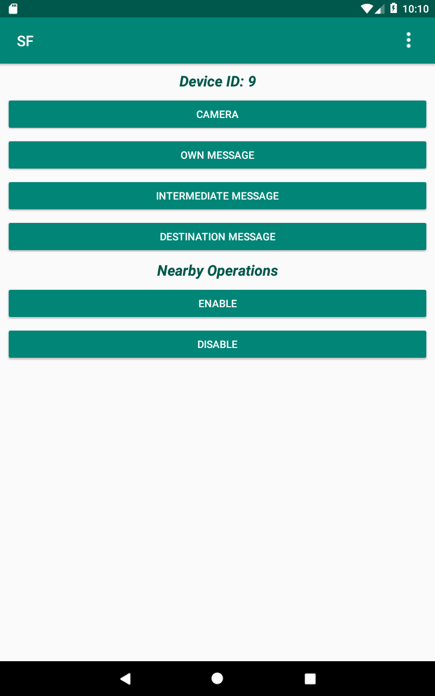
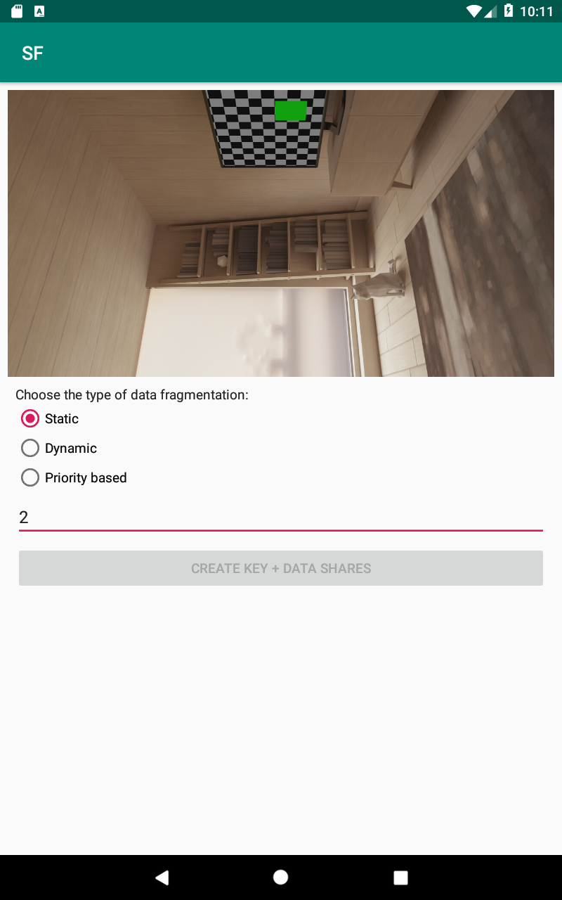
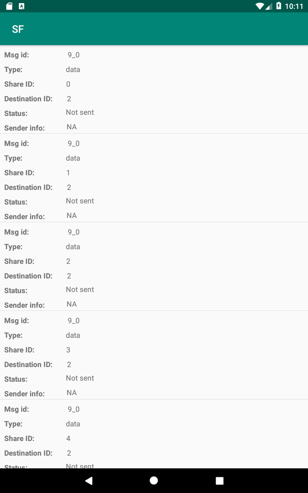

# SecureForwarding
An android app is created to transfer data between the nodes in a network using Bluetooth and Wifi. This app maily focuses on Military applications. The basic idea is to fragment data and key into n shares, the destination node can recover the data if it gets k key and data shares from other intermediate nodes (where k<n). This implementation is based on paper "Secure Information Forwarding through Fragmentation in Delay-tolerant Networks"

Libraries used : JavaReedSolomon, RxAndroid, Butterknife, Firebase, Room

Home screen - Capture image, start/end google nearby \n 

